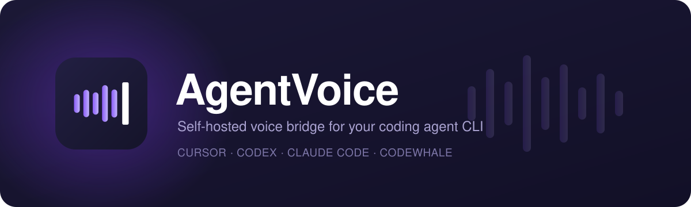

<p align="center">
  
</p>

<h1 align="center">AgentVoice</h1>

<p align="center">
  <a href="https://www.npmjs.com/package/@ratitisrad/agentvoice"></a>
  <a href="https://nodejs.org"></a>
  <a href="./LICENSE"></a>
</p>

<p align="center">
  <em>Formerly "Cursor Voice" — see <a href="./docs/26-rename-agentvoice.md"><code>docs/26-rename-agentvoice.md</code></a>.</em>
</p>

Self-hosted voice bridge for driving a coding agent CLI —
[Cursor](https://cursor.com/docs/cli) (`cursor-agent`), [Codex](https://github.com/openai/codex),
[Claude Code](https://github.com/anthropics/claude-code), or
[Codewhale](https://github.com/dixonSolutions/CodeWhale) (`codewhale`) — by
**speech, from your phone**.

Speak from an iPhone **native app (CallKit)** or PWA; the active agent CLI is the reasoning
layer via the **agent-voice MCP server** (`speak`, `done`, `next_voice_turn`) — the MCP
registration key stays `agent-voice` for compatibility. Coding work is
delegated to worker agents via `spawn_agent`. **Speech is pluggable in both
directions** — listen with the browser, a **self-hosted Whisper container**
(no key, audio never leaves the host), Groq, OpenAI, Deepgram, Gemini,
ElevenLabs, OpenRouter or Amazon Transcribe; speak with the browser, a local
Kokoro voice, ElevenLabs, OpenAI, Gemini, Deepgram, Groq or Polly. Each side is
an ordered fallback chain that skips any provider which cannot handle the
language, so a device with no Polish voice hands that reply to one that has one.
Configured and keyed from Config → Speech — see
[`docs/29`](./docs/29-speech-to-text-providers.md),
[`docs/30`](./docs/30-speech-output-providers.md) and
[`docs/31`](./docs/31-service-orchestrator-converter.md).
If the CLI needs you to sign in, the app prompts you
in place — see [`docs/24-agent-providers.md`](./docs/24-agent-providers.md).

Networking defaults to Tailscale but is pluggable — Cloudflare Tunnel, ngrok,
Azure Dev Tunnels, plain LAN, or your own reverse proxy also work, one-click
from Config → Serve → Network. See
[`docs/25-hosting-providers.md`](./docs/25-hosting-providers.md).

## How it works

```
iPhone PWA (Vosk wake + STT + TTS)
        │  /ws/intelligence (app token)
        ▼
Bridge (Node/TS) ── VoiceTurnQueue ── MCP /mcp ──► Cursor voice agent
        │                                              │
        │                                              ▼ spawn_agent
        └──────────────────────────────────────► cursor-agent workers → git
```

**Default workflow:** `agent_native` — see [`docs/16-mcp-server-agent-as-brain.md`](./docs/16-mcp-server-agent-as-brain.md).

**Alternate:** `llm_intelligence` — Claude on Bedrock orchestrates tools.

## Install

AgentVoice ships as an npm package. The bridge and the built web app come in
the same tarball — no checkout, no build step:

```bash
# Run it once, without installing
npx @ratitisrad/agentvoice

# Or install the `agentvoice` command globally
npm install -g @ratitisrad/agentvoice
agentvoice
```

On its first run the bridge creates a **home directory** — `~/.agentvoice`,
or `$AGENTVOICE_HOME` if you set one — seeds `config.json` from the packaged
example, generates a random `APP_TOKEN` into `~/.agentvoice/.env`, and prints
that token once. Then it starts up and logs the address it is listening on
(`http://127.0.0.1:5089` — an installed package starts in the `serve` profile,
because it serves the built PWA itself; `PORT` picks another port on first run). Open that address —
the PWA is served from the same port — and paste the token when it asks you to
pair.

Everything the bridge writes — `config.json`, `data/state.db`, logs — stays in
that home directory, so `npm update -g @ratitisrad/agentvoice` never touches your state.
Run `agentvoice` from a directory that already has a `config.json` (a repo
checkout, say) and it uses that directory instead.

The default configuration is local-only (the `local` hosting provider), uses Codex, and discovers immediate Git repositories under
`~/Projects`. Add nested project containers to
`settings.projectDiscovery.hotPaths` when needed; no hand-maintained project
list is required. Requires **Node 20+** and one of the agent CLIs —
`cursor-agent`, `codex`, `claude`, or `codewhale` — on your `PATH`.

### Install from apt / dnf

Signed repositories for amd64 and arm64 are published at
https://dixonsolutions.github.io/AgentVoice/ — upgrades then arrive with the
rest of your system (`apt upgrade` / `dnf upgrade`).

**Debian / Ubuntu**

```bash
sudo install -d -m 0755 /etc/apt/keyrings
sudo curl -fsSL https://dixonsolutions.github.io/AgentVoice/agentvoice.asc -o /etc/apt/keyrings/agentvoice.asc
sudo curl -fsSL https://dixonsolutions.github.io/AgentVoice/apt/agentvoice.sources -o /etc/apt/sources.list.d/agentvoice.sources
sudo apt update && sudo apt install agentvoice
```

**Fedora / RHEL**

```bash
sudo curl -fsSL https://dixonsolutions.github.io/AgentVoice/rpm/agentvoice.repo -o /etc/yum.repos.d/agentvoice.repo
sudo dnf install agentvoice
```

Both enable AgentVoice as a background user service out of the box; then run
`agentvoice setup`, and `loginctl enable-linger "$USER"` to keep it running after logout.
See [docs/43](docs/43-package-repos.md) for details.

## The `agentvoice` command

Booting the bridge is only the default. The same command manages the install:

```bash
agentvoice status          # install, version, service, port, health, public URL — one screen
agentvoice doctor          # Node, native binding, config, agent CLI + sign-in, port, service, hosting
agentvoice service install --now   # run it in the background (systemd, launchd or Windows service)
agentvoice restart         # bounce the service
agentvoice logs -f         # follow the service journal (or the session log file)
agentvoice logs --list     # every session log and voice transcript on disk
agentvoice pipe --mic      # talk to the agent from this terminal, no phone needed
agentvoice update          # rebase a clone, or npm-install a newer package
agentvoice token --new     # rotate the pairing token
agentvoice <command> --help   # just that command's options
```

Speech reaches the agent in **turns** by default — wake phrase, then VAD, then
one whole request — and that is the recommended mode. A **direct audio stream**
is also available, from the phone (Config → Listening & controls → Input mode)
or from anything that produces PCM: the bridge cuts it at your pauses and hands
each piece to the agent as you talk
([`docs/41`](./docs/41-audio-stream-pipe.md)):

```bash
arecord -f S16_LE -r 16000 -c 1 -t raw | agentvoice pipe
```

Every bridge run writes a date-named session log and every voice session a
transcript under `<home>/logs/`, gzipped as they pile up
([`docs/42`](./docs/42-logging.md)).

`status` is the one to reach for first. It reports how AgentVoice was installed
and therefore how it updates, the version (branch and drift for a clone, the
registry's `latest` for an npm install), whether the service is running and
since when, the port it is listening on and where that port came from, what
`/healthz` says, and whether a pairing token is configured — never the token
itself. Add `--json` for machine output. It exits `1` when the bridge is not
answering, so `agentvoice status >/dev/null` works as a liveness probe.

`update` follows the install rather than guessing: a clone runs
`scripts/update.sh` (pass `--stash` to carry local changes across the rebase),
an npm install runs `npm install -g @ratitisrad/agentvoice@latest` (without `-g`
for a project dependency), an `npx` run tells you to start it with `@latest`,
and a .deb / .rpm install prints the `apt` / `dnf` command instead of fighting
the package manager.

Full reference: [`docs/35-cli.md`](./docs/35-cli.md).

## Quick start (dev)

```bash
cp config.example.json config.json
cp .env.example .env   # set APP_TOKEN + AWS IAM keys
npm install
npm run dev
```

Open the web URL shown in the terminal (unified port in test mode).
The example uses Codex with the workspace sandbox, no Tailscale or public
hosting, and automatically picks up Git repositories directly under
`~/Projects`.

## Host on Windows (one-command setup)

Prerequisites: [Node.js 20 LTS](https://nodejs.org), [Git](https://git-scm.com), and one agent CLI on PATH — `cursor-agent`, `codex`, `claude` or `codewhale`.

```powershell
# 1. Clone the repo
git clone https://github.com/dixonSolutions/AgentVoice.git
cd AgentVoice
# Formerly Cursor-Voice — see docs/26-rename-agentvoice.md

# 2. Run setup — installs Tailscale, builds the project, creates .env,
#    installs a Windows Service (NSSM), and configures tailscale serve.
#    Run in an elevated (Administrator) PowerShell terminal.
.\scripts\setup.ps1
```

After setup, the script prints your `APP_TOKEN`. Enter it in the PWA settings screen.

**After initial setup:**

```powershell
# Rebuild and restart after code changes
.\scripts\restart.ps1

# Diagnose connectivity issues
.\scripts\doctor.ps1
```

> **Tailscale required.** The setup script installs Tailscale via winget if it is not present.
> After installation, sign in to Tailscale and enable **HTTPS Certificates** in the
> [Tailscale admin console](https://login.tailscale.com/admin/dns) to get a trusted HTTPS URL.

## Host on Linux (one-command setup)

Prerequisites: Node.js 20 LTS, Git, and one agent CLI on PATH — `cursor-agent`, `codex`, `claude` or `codewhale`.

```bash
# 1. Clone the repo
git clone https://github.com/dixonSolutions/AgentVoice.git
cd AgentVoice
# Formerly Cursor-Voice — see docs/26-rename-agentvoice.md

# 2. Run setup — installs Tailscale, builds, creates .env,
#    installs a systemd user service, and configures tailscale serve.
bash scripts/setup.sh
```

**After initial setup:**

```bash
# Rebuild and restart after code changes
bash scripts/restart.sh

# Diagnose connectivity issues
bash scripts/doctor.sh
```

**Already hosted manually?** Install the systemd user service without re-running full setup:

```bash
bash scripts/install-systemd.sh
```

**Local development vs. the production host:**

The two run on **separate ports**, so they never collide and can run side by side:

| | Command | Run profile | Bridge port |
| --- | --- | --- | --- |
| **Dev** (hot reload) | `npm run dev` | `test` (forced when `NODE_ENV=development`) | `5089` (loopback) |
| **Host** (background service) | `npm run start:service` | `serve` (from `config.json`) | `8787` (Tailscale) |

```bash
# Hot-reload dev server. Open http://localhost:4200 — /api + /ws proxy to :5089.
npm run dev

# Manage the long-running production host service (independent of dev):
npm run stop            # stop the host service + its rebuild watcher, free :8787
npm run start:service   # start the host service back up (health-checked)
```

> `config.json` → `settings.runMode` controls the **host** only. `npm run dev`
> always uses the `test` profile (port `runModes.test.backendPort`, default `5089`),
> regardless of `runMode`.

## Documentation

Full design in [`docs/`](./docs) — start with [`docs/README.md`](./docs/README.md).

| Doc | Topic |
| --- | --- |
| [`02-architecture.md`](./docs/02-architecture.md) | System architecture |
| [`06-voice-audio-webrtc.md`](./docs/06-voice-audio-webrtc.md) | STT, TTS, VAD, wake words |
| [`16-mcp-server-agent-as-brain.md`](./docs/16-mcp-server-agent-as-brain.md) | Default Cursor voice workflow |
| [`11-mcp-tool-surface.md`](./docs/11-mcp-tool-surface.md) | MCP tool inventory |
| [`20-native-callkit-shell.md`](./docs/20-native-callkit-shell.md) | CallKit native app + push notifications |
| [`23-multi-agent-client.md`](./docs/23-multi-agent-client.md) | Cursor / Codex / Claude Code / Codewhale CLI setup |
| [`24-agent-providers.md`](./docs/24-agent-providers.md) | In-app auth, live model selection (per-model effort / fast from each CLI), generic MCP tools |
| [`25-hosting-providers.md`](./docs/25-hosting-providers.md) | Tailscale, Cloudflare, ngrok, Dev Tunnels, LAN, manual |
| [`33-permissions-and-prompt-relay.md`](./docs/33-permissions-and-prompt-relay.md) | Permission modes per CLI, permission prompts and sudo passwords relayed to the phone |
| [`35-cli.md`](./docs/35-cli.md) | The `agentvoice` management CLI |
| [`36-disconnect-and-background-work.md`](./docs/36-disconnect-and-background-work.md) | Design: disconnect policy, unattended work, surviving bridge restarts |
| [`37-session-directory-and-inject.md`](./docs/37-session-directory-and-inject.md) | Design: list running sessions and inject into them by voice |
| [`38-system-packages.md`](./docs/38-system-packages.md) | Design: .deb / .rpm packages and a system install mode |
| [`39-config-ui-and-narration-cleanup.md`](./docs/39-config-ui-and-narration-cleanup.md) | Config screen audit and bridge narration toggles + templates |
| [`40-prompts-orb-and-permissions.md`](./docs/40-prompts-orb-and-permissions.md) | Design: prompts read aloud, ask tools and tool overlap, orb working state, remembered mic permission |
| [`41-audio-stream-pipe.md`](./docs/41-audio-stream-pipe.md) | Direct audio stream input — the phone's stream mode and `agentvoice pipe` |
| [`42-logging.md`](./docs/42-logging.md) | Session log files, voice transcripts, gzip rollover, `agentvoice logs` |
| [`26-rename-agentvoice.md`](./docs/26-rename-agentvoice.md) | Cursor Voice → AgentVoice rename notes |

## Stack

- **Bridge:** Node.js 20+, TypeScript, Fastify, MCP SDK, SQLite
- **Web app:** Angular PWA + vanilla TS voice modules (Vosk, Silero VAD)
- **Voice I/O:** pluggable STT/TTS chains — browser, self-hosted Whisper / Kokoro, or cloud providers (see docs/29 and docs/30)
- **Reasoning:** the active agent CLI (`agent_native`) or Bedrock Claude (`llm_intelligence`)
- **Executor:** Cursor, Codex, Claude Code, or Codewhale CLI (`settings.agentClient`, see [`docs/24-agent-providers.md`](./docs/24-agent-providers.md))
- **Network:** Tailscale by default; Cloudflare Tunnel, ngrok, Azure Dev Tunnels, LAN, or manual (see [`docs/25-hosting-providers.md`](./docs/25-hosting-providers.md))

## Configuration

- **`.env`** — `APP_TOKEN`, `AWS_ACCESS_KEY_ID`, `AWS_SECRET_ACCESS_KEY`
- **`config.json`** — projects, wake words, input mode, workflow, logging, operational settings

See [`docs/07-data-and-deployment.md`](./docs/07-data-and-deployment.md).
